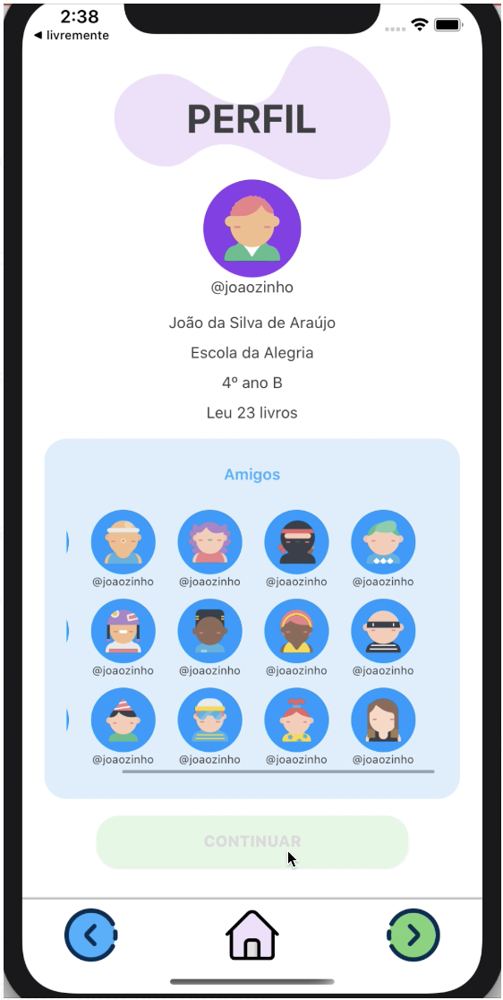
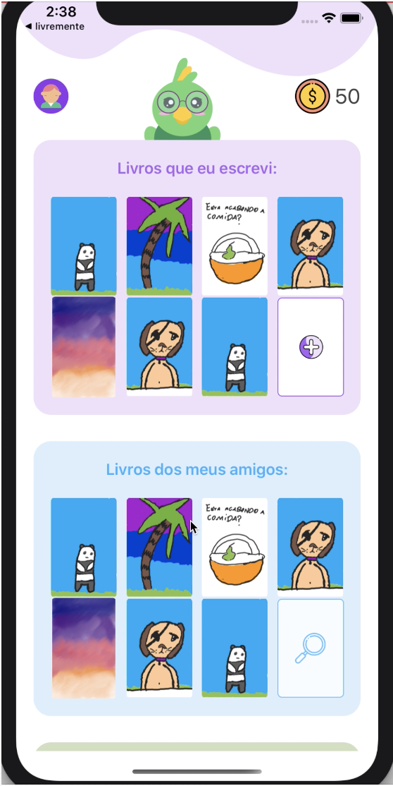
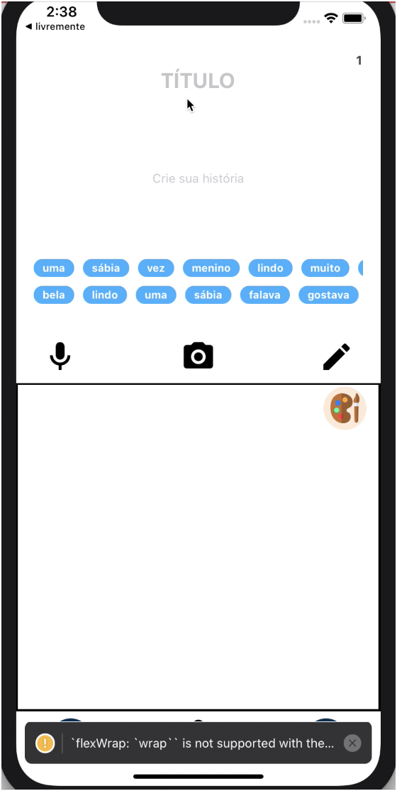

# MegaHack 3: Equipe 25

----
## Desafio escolhido: Árvore Educação
veja [Árvore Educação](https://arvoreeducacao.com.br/)

> Objetivo 2: engajar os leitores a lerem mais.


----
## Nossa solução: SeedBook (Repositório backend)
Montamos uma **rede social** para alunos que incentiva leitura.



Também estimulamos a criação, indicação, compra e venda de livros **feito pelos próprios alunos** e o compartilhamento de trechos dos livros em áudio e de imagens dos desenhos criados no aplicativo. 


Também disponibilizamos **Certificados**, para demonstrar o desenvolvimento dos alunos no aplicativo.



## Flow
1. Quando a criança decide “começar” sua jornada, ela é redirecionada a uma tela que contém vários “Cards”. Na nossa base de dados, cada um desses cards foram avaliados e tem um perfil. A criança seleciona os cards que ela mais gosta e chama nossa API que faz uma média do perfil desses cards para calcular o “perfil leitor” da criança.
2. Na próxima tela, vemos o perfil da criança. Aqui chamamos a API para buscar todos os usuários que são da mesma sala de aula da criança. 
3. Na nossa editora, os alunos podem escrever uma história sem restrições, temos também a funcionalidade que permite que a criança desenhe no seu “livro”. 
4. Na nossa curadoria, a lista de palavras disponíveis para o aluno é gerada através de livros selecionados pelo professor. Usamos processamento de linguagem natural para obter as palavras do livro e remover palavras parecidas para aumentar a variação.
5. Por fim, temos a livraria. Na livraria, vamos ter os livros escritos pela criança e seus amigos (que autorizarem a amostra). Na sessão das recomendações, usamos o perfil leitor do usuário calculado com os cards para recomendar livros. Esse sistema é um exemplo de um sistéma de recomendação chamado **“knowledge based recommendation”**: calculamos a distancia euclideana entre o vetor descrevendo as preferências do usuário e as propriedades dos livros para sugerir as melhores combinações! 

## Tecnologia
Stack: NodeJS, MongoDB, Strapi, AWS

### POST /kids/cards/:id
`Request Body`: Cardlist contém as id's das cards selecionadas pelo usuário
```
"cardlist": [<id1>, <id2>, <id3>]
```

`Returns`:
```
"Perfil do leitor calculado com sucesso!": [3.0002, 2.0009, 1.778893, 3.7, 0.008889]
```

No primeiro passo, fazemos um mapeamento do perfil leitor do aluno por meio de cards. Cada um desses cards tem um "perfil" na nossa base de dados, que é um vetor de cinco dimensões enumeradas de 0-5 mapeando características como a personalidade dos personagens, atmosféra e clima. Quando o aluno escolhe os cards que ele mais gosta, calculamos uma média desses cards para representar o perfil leitor do aluno. 

Como definimos o perfil leitor: [a, b, c, d, e] 
* a: Cenário (0-N/A, 1-urbano, 2-Natureza, 3-Cartoon, 4-Fantasioso) - Por exemplo, Nárnia se encaixa em um cenário 4, e Pokemon em um cenário 3
* b: Gênero (0-N/A, 1-tendência masculina 2-tendência feminina) - **Esse valor não está relacionado ao genero da criança, somente o do personagem** Por exemplo, turma da mônica seria gênero 0, Cinderella seria gênero 2
* c: Esfera (0-N/A, 1-Realidade com componentes fantasiosos, 2-Fantasia com componentes reais 3-Um mundo totalmente imaginário) - Por exemplo, Bob Esponja se encaixa em 3, e Harry Potter se encaixa em 2)
* d: Clima (0-N/A, 1-Comédia, 2-Feliz, 3-Aventura/Curioso 4-Romântico) - Por exemplo, Garfield se encaixa em (1) e Peter Pan em (3)
* e: Personagens (0-N/a, 1-Humano, 2-Princesa/Principe, 3-Animal, 4-Avatar/Game, 5-Criatura ficticia)

**Nota** Na próxima vez que o endpoint for chamado para o mesmo aluno, re-calculamos a média dos cards accumulados dele. Esse perfil leitor é usado para recomendarmos livros para o aluno. 

### GET /kids/recommend/:id
`Request Body`: vazio

`Returns`:
```
{
  "Ranking de livros" : [ 
                              [{
                                  "title" : "Onde Os Monstros Vivem",
                                   "id": "5f00eda2a9094208ba0eeb28",
                                   "cover" : {
                                   ....
                                   "url": "https://megahack3.s3.us-west-1.amazonaws.com/monstros_892efb3583.jpeg",
                                   "formats": {
                                      "thumbnail": {
                                         "hash": "thumbnail_monstros_892efb3583",
                                         "ext": ".jpeg",
                                        "url": "https://megahack3.s3.us-west-1.amazonaws.com/thumbnail_monstros_892efb3583.jpeg"
                                      }
                                  }
                               }],
                               [{
                                   "title" : "Peter Pan",
                                   "id": "5f00eda2a9094208ba0eeb28",
                                   "cover" : {
                                   ....
                                   "url": "https://megahack3.s3.us-west-1.amazonaws.com/monstros_892efb3583.jpeg",
                                   "formats": {
                                      "thumbnail": {
                                         "hash": "thumbnail_monstros_892efb3583",
                                         "ext": ".jpeg",
                                        "url": "https://megahack3.s3.us-west-1.amazonaws.com/thumbnail_monstros_892efb3583.jpeg"
                                      }
                                  }
                                }]
}
```

Esse endpoint recebe o id do usuário e calcula a distância euclideana (foto da equação) entre o perfil do usuário e o perfil de cada livro disponível na base de dados que está classificado como apropriado para a idade dele. Endpoint retorna uma lista ordenada do livro mais próximo, até o mais distante do perfil do usuário.

### GET /kids/words/:id
`Request Body`: vazio

`Returns`:
```
{
   
     "Palavras": [            
        "Toda",
        "conhece",
        "caminho",
        "mágico",
        "seu",
        "ciumento",
        "amigo",
        "fadas",
        "Tinker",
        "Bell",
        "Peter",
        "Pan",
        "incomoda",
        "obviamente",
        "crianças",
        "Darling",
        "Wendy",
        "John",
        "Michael",
        "sair",
        "voar",
        "Neverland",
        ....
        ]
}
```

Esse endpoint recebe o id do aluno e busca os livros recomendados pelo professor do aluno. O endpoint busca trechos dos livros na nossa base de dados e usa a biblioteca "natural" do NodeJS para aplicar funções de procesamento de linguagem natural (NLP), parseando os textos em palavras e usando a equação chamada JaroWinklerDistance para remover palavras muito parecidas/iguais removendo redundâncias. Nós removemos todas as palavras que tem uma distância acima de 0.9, e podemos variar esse valor para aumentar/diminuir a diferença entre as palavras. 

### GET /kids/sameclass/:id
`Request Body`: vazio
`Returns`:
```
{
    "kids": [
        {
            "books_read": [],
             "books_writtens": [],
            "_id": "5f014770a9094208ba0eeb39",
            "goods": [],
            "profile": null,
            "name": "Clara",
            "birthDate": "2012-02-01",
            "coins": "4",
            "createdAt": "2020-07-05T03:22:24.876Z",
            "updatedAt": "2020-07-05T23:51:31.375Z",
            "__v": 0,
            "class": null,
            "isOnline": true,
            "classgroup": {
                "books": [
                    "5f00e9aca9094208ba0eeb1e",
                    "5f00ee4fa9094208ba0eeb2b"
                ],
                "kid_written_books": [],
                "kids": [],
                "_id": "5f00fccdd4a65ab9b5588e06",
                "words": null,
                "ageRange": "2",
                "teacherName": "Laura",
                "createdAt": "2020-07-04T22:03:57.137Z",
                "updatedAt": "2020-07-06T00:24:46.681Z",
                "__v": 0,
                "kid": "5f00a26a3ed4d29bf3f6e6a1",
                "id": "5f00fccdd4a65ab9b5588e06"
            },
            "profilepicture": "girl-8",
            "goods_owned": [],
            "id": "5f014770a9094208ba0eeb39"
        },
        ]
    }
```

Esse endpoint recebe o id do aluno e retorna todos os usários registrados no aplicativo que estão na mesma sala de aula do aluno. 

### GET /kids/shop/:id
`Request Body`:
```
“goods” : [<goodId1>, <goodId2>”]
```
Esse endpoint recebe o id do aluno e uma lista dos ids dos objetos que ele quer comprar na loja. A API verifica que o aluno tem moedas o suficiente, e atualiza suas moedas e bens para refletir a compra. 

----
## Equipe
* [Cleanderson Lobo](https://www.linkedin.com/in/cleandersonlobo/?originalSubdomain=br) - Software
* [Daniel Moura](https://www.linkedin.com/in/daniel-m-araujo/) - Business
* [Daniella Grimberg](https://www.linkedin.com/in/daniella-grimberg-139a9614b/?originalSubdomain=br) - Software
* [Laura Fiuza](https://www.linkedin.com/in/laura-fiuza-ba1077b4/) - Software
* [Sara Margarido](https://www.linkedin.com/in/saramargarido/?originalSubdomain=br) - Design
